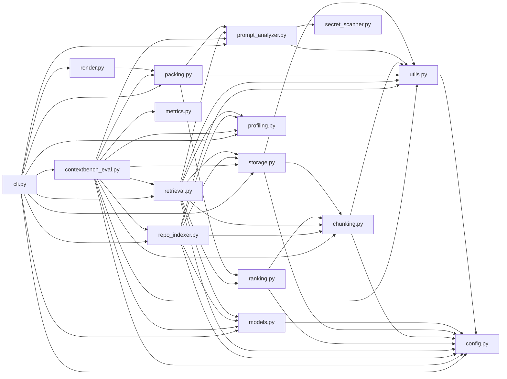
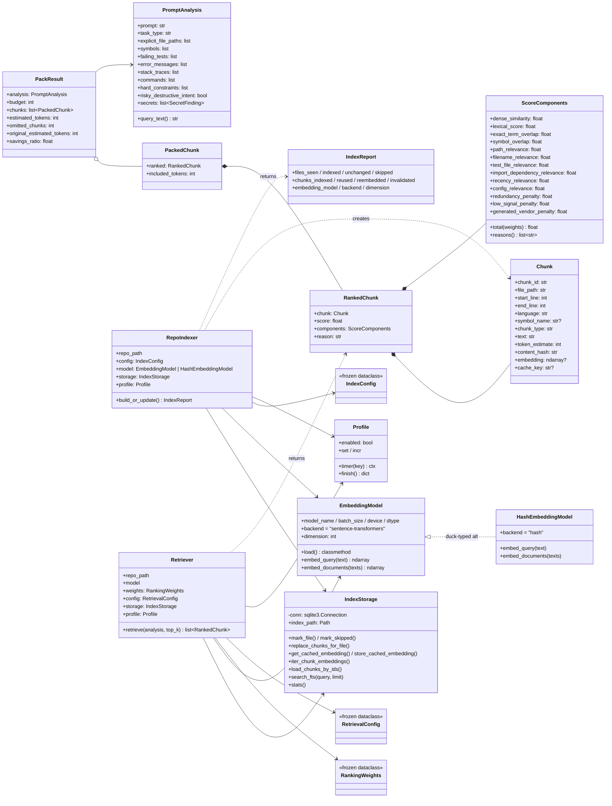
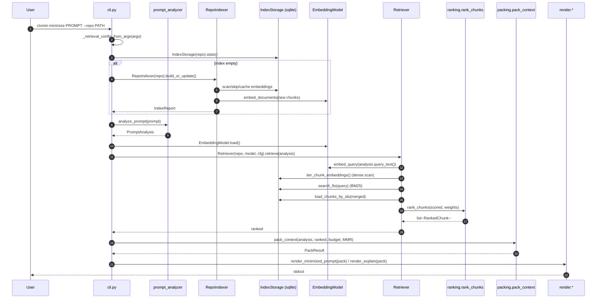
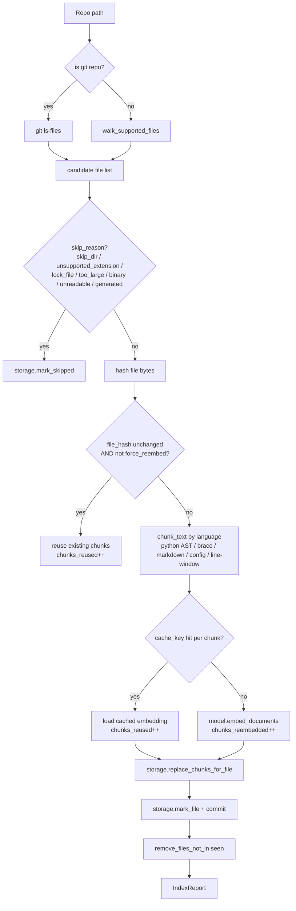
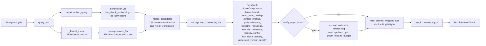

# ctxmin — Code Diagram

Visual map of the [ctxmin/](ctxmin/) package: how modules depend on each other, the main data types they exchange, and how a request flows through the system.

---

## 1. Module dependency graph

Arrows go from importer → imported. Leaves on the right (`config`, `utils`, `secret_scanner`) have no internal dependencies.



---

## 2. Key types and relationships

Dataclasses and the few stateful classes, grouped by role.



---

## 3. Request flow — `ctxmin minimize` / `explain`

Top-level path from CLI invocation to rendered output. `_build_pack` is the shared core; `minimize` and `explain` only differ in how they render the resulting `PackResult`.



---

## 4. Indexing pipeline — `ctxmin index`

What happens inside `RepoIndexer.build_or_update()`.



Schema written by `IndexStorage._init_schema()`:

- `settings(key, value)` — embedding model/backend/dim, chunker_version, normalization_version
- `files(file_path, file_hash, language, indexed_at, skipped_reason)`
- `skipped_files(file_path, reason)`
- `chunks(chunk_id, file_path, start_line, end_line, language, symbol_name, chunk_type, text, token_estimate, content_hash, cache_key, embedding BLOB)`
- `embedding_cache(cache_key, model_name, model_revision, embedding_backend, embedding_dim, chunk_hash, chunker_version, normalization_version, file_path, file_hash, embedding BLOB, created_at)`
- `chunk_fts` — FTS5 virtual table over `(file_path, symbol_name, chunk_type, language, text)` with custom `tokenchars '_./-'`

---

## 5. Retrieval pipeline — inside `Retriever.retrieve()`



Then `pack_context` ([packing.py](ctxmin/packing.py)) takes the ranked list, optionally re-orders via MMR (`mmr_lambda`, embedding cosine vs token Jaccard fallback), and greedily fills the token budget — explicit-file-path matches get a small overflow allowance (+300 tokens).

---

## 6. ContextBench evaluation — `ctxmin bench-contextbench`

```mermaid
flowchart TD
  CMD["CLI: bench-contextbench<br/>--mode {gold-only, distractor, full-repo}"] --> EV[evaluate_contextbench]
  EV --> DS[load dataset<br/>default | contextbench_verified]
  DS --> PR[PreparedRepo<br/>(checkout / synth distractors)]
  PR --> IX2[RepoIndexer.build_or_update]
  IX2 --> RT2[Retriever.retrieve]
  RT2 --> PK2[pack_context]
  PK2 --> ME[metrics:<br/>file_metrics, span_metrics,<br/>span_overlap, token_savings]
  ME --> RPT[result JSON +<br/>optional Profile]
```

---

## File index (with line-anchored entry points)

- [ctxmin/cli.py](ctxmin/cli.py) — argparse entry point. `build_parser` [cli.py:155](ctxmin/cli.py#L155); `_build_pack` [cli.py:55](ctxmin/cli.py#L55); subcommand handlers [cli.py:20-152](ctxmin/cli.py#L20-L152)
- [ctxmin/config.py](ctxmin/config.py) — constants + frozen dataclasses `RankingWeights` [config.py:103](ctxmin/config.py#L103), `RetrievalConfig` [config.py:120](ctxmin/config.py#L120), `IndexConfig` [config.py:139](ctxmin/config.py#L139)
- [ctxmin/models.py](ctxmin/models.py) — `EmbeddingModel` [models.py:55](ctxmin/models.py#L55) and `HashEmbeddingModel` [models.py:20](ctxmin/models.py#L20) fallback
- [ctxmin/chunking.py](ctxmin/chunking.py) — `Chunk` [chunking.py:12](ctxmin/chunking.py#L12); language-specific chunkers; `chunk_text` dispatcher [chunking.py:219](ctxmin/chunking.py#L219)
- [ctxmin/storage.py](ctxmin/storage.py) — `IndexStorage` SQLite + FTS5 [storage.py:19](ctxmin/storage.py#L19)
- [ctxmin/repo_indexer.py](ctxmin/repo_indexer.py) — `RepoIndexer.build_or_update` [repo_indexer.py:110](ctxmin/repo_indexer.py#L110); `IndexReport` [repo_indexer.py:29](ctxmin/repo_indexer.py#L29)
- [ctxmin/retrieval.py](ctxmin/retrieval.py) — `Retriever.retrieve` [retrieval.py:272](ctxmin/retrieval.py#L272); per-feature scorers [retrieval.py:85-182](ctxmin/retrieval.py#L85-L182)
- [ctxmin/ranking.py](ctxmin/ranking.py) — `ScoreComponents` [ranking.py:9](ctxmin/ranking.py#L9), `rank_chunks` [ranking.py:97](ctxmin/ranking.py#L97)
- [ctxmin/packing.py](ctxmin/packing.py) — `pack_context` with MMR [packing.py:94](ctxmin/packing.py#L94)
- [ctxmin/render.py](ctxmin/render.py) — `render_minimized_prompt` [render.py:12](ctxmin/render.py#L12), `render_explain` [render.py:78](ctxmin/render.py#L78)
- [ctxmin/prompt_analyzer.py](ctxmin/prompt_analyzer.py) — regex-based `analyze_prompt`
- [ctxmin/secret_scanner.py](ctxmin/secret_scanner.py) — `scan_text` for credentials in prompts
- [ctxmin/profiling.py](ctxmin/profiling.py) — `Profile` timing + counters
- [ctxmin/metrics.py](ctxmin/metrics.py) — span/file overlap and token-savings metrics for benchmarks
- [ctxmin/contextbench_eval.py](ctxmin/contextbench_eval.py) — `evaluate_contextbench` orchestrator
- [ctxmin/utils.py](ctxmin/utils.py) — paths, hashing, git helpers, language detection
