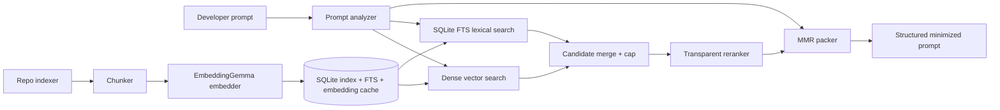
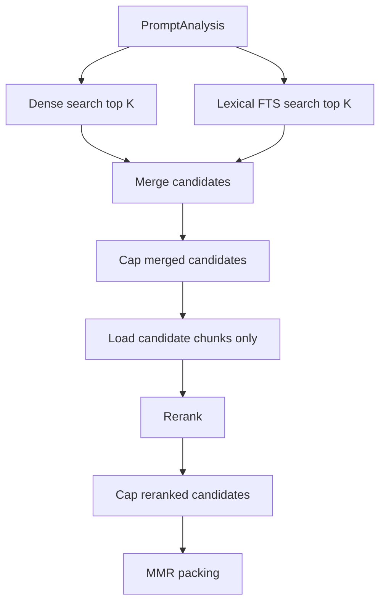

# ctxmin Model Architecture

This document explains the model and retrieval architecture behind `ctxmin`, the
local Context Minimization Gateway for coding agents.

`ctxmin` is not a generative summarizer. Its primary behavior is extractive:
it analyzes a developer prompt, indexes local repository chunks, retrieves and
ranks the smallest relevant set of chunks, and renders a structured prompt for
an agent such as Codex CLI or Claude Code.

## Architecture Summary



The neural model is used only for local embeddings. All ranking, filtering,
packing, benchmark comparison, and explanation are deterministic or
rule-based Python code.

## Model Boundary

The primary embedding model is:

```text
google/embeddinggemma-300m
```

It is loaded through `sentence-transformers` in `ctxmin/models.py`.

`ctxmin` calls:

- `encode_query` for developer prompts when available
- `encode_document` for code and documentation chunks when available
- `encode` as a fallback when those specialized methods are unavailable

Vectors are normalized to unit length and handled as `float32` at runtime. The
tool intentionally avoids `float16` for CPU-first reliability. `bfloat16` can be
requested for compatible acceleration paths, but CPU mode is the default,
first-class path.

If `sentence-transformers` or the model cannot be loaded and fallback is
allowed, `ctxmin` can use a deterministic local hash embedding backend. That
backend exists for smoke tests and offline unit tests; it is not the intended
production retriever.

## End-to-End Data Flow

1. The user runs a command such as:

   ```bash
   ctxmin minimize "fix the failing contextbench distractor benchmark" --repo . --budget 6000
   ```

2. `prompt_analyzer.py` extracts deterministic signals from the prompt:

   - task type
   - explicit file paths
   - symbols
   - stack traces
   - error messages
   - failing tests
   - commands
   - hard constraints
   - risky/destructive intent
   - secrets

3. `repo_indexer.py` builds or updates a local index for the repository.

4. `chunking.py` splits source files into small chunks.

5. `models.py` embeds changed chunks locally.

6. `storage.py` stores chunk metadata, text, embeddings, cache entries, and FTS
   rows in SQLite under:

   ```text
   ~/.ctxmin/indexes/<repo_hash>/
   ```

7. `retrieval.py` generates dense and lexical candidates.

8. `ranking.py` computes an explainable score for each merged candidate.

9. `packing.py` uses a token budget and MMR ordering to select final chunks.

10. `render.py` emits the minimized prompt in a structured format.

## Prompt Analyzer

The prompt analyzer is local and deterministic. It does not call an LLM.

Its job is to turn a free-form developer request into retrieval signals. For
example, this prompt:

```text
Fix ctxmin bench-contextbench --mode distractor. Span precision dropped in
ctxmin/contextbench_eval.py and tests/test_retrieval_pipeline.py.
```

can produce signals such as:

```text
task_type: bug_fix
explicit_file_paths:
- ctxmin/contextbench_eval.py
- tests/test_retrieval_pipeline.py
symbols: []
commands: []
hard_constraints: []
```

Those signals are later used by lexical search, path-aware scoring,
symbol-aware scoring, test relevance, and final prompt packing.

## Repository Indexing

By default, the indexer prefers git-tracked source-like files. This keeps the
index focused on files a coding agent can reasonably edit.

The indexer skips paths such as:

- `.git`
- `node_modules`
- `dist`
- `build`
- `target`
- `.venv`
- `venv`
- `__pycache__`
- coverage and cache directories
- large binaries
- images
- lock files unless configured otherwise
- generated files when detectable

Each indexed chunk includes:

```text
chunk_id
repo_path
file_path
start_line
end_line
language
symbol_name
chunk_type
text
token_estimate
content_hash
embedding
cache_key
```

## Chunking Strategy

`ctxmin` tries to keep chunks semantically meaningful and small enough for
EmbeddingGemma's input window.

Current chunking behavior:

- Python: AST-based functions, async functions, classes, methods, and tests
- JavaScript/TypeScript/Java/Go/Rust/C/C++: brace/symbol based fallback chunks
- Markdown: heading-level sections
- YAML/JSON/TOML/config: smaller logical line-window chunks
- Unknown text: overlapping line windows

Long chunks are split with overlap so retrieval can still point to tight line
ranges instead of full files.

## Embedding Cache

The embedding cache is designed to avoid re-embedding unchanged chunks.

The cache key includes:

- model name
- model revision
- backend type
- embedding dimension
- chunker version
- normalization version
- file path
- chunk content hash

This prevents stale vectors from being reused when:

- the model changes
- the embedding dimension changes
- the backend changes from hash fallback to real EmbeddingGemma
- chunking logic changes
- chunk text changes

During profiling, the indexer reports:

```text
Embedding cache:
- reused: N chunks
- re-embedded: N chunks
- invalidated: N chunks
- backend: sentence-transformers / hash
- model: google/embeddinggemma-300m
- embedding_dim: 768
```

## Local Storage

`ctxmin` uses SQLite as the local index store.

Main tables:

- `settings`: model, backend, dimension, chunker, and repo metadata
- `files`: indexed file hashes and language metadata
- `skipped_files`: skipped paths and reasons
- `chunks`: chunk metadata, text, and embedding blob
- `embedding_cache`: reusable embeddings keyed by robust cache keys
- `chunk_fts`: SQLite FTS5 index for disk-backed lexical search

The lexical index is disk-backed. The retriever does not need to load the full
lexical corpus into Python memory.

## Retrieval Pipeline

Retrieval is hybrid and memory-bounded.



Default limits are intentionally conservative:

```text
dense_top_k: 200
lexical_top_k: 200
max_candidates: 300
rerank_top_k: 80
mmr_top_k: 80
mmr_lambda: 0.35
graph_boost: false
```

Dense search streams embeddings from SQLite and keeps only the top K candidates
in a heap. Lexical search uses SQLite FTS5 and returns lightweight candidate
IDs and scores. Full chunk text is loaded only for merged candidates.

## Dense Retrieval

Dense retrieval embeds the analyzed query text with EmbeddingGemma and compares
it to stored normalized chunk embeddings.

The dense score is cosine similarity normalized into a 0 to 1 range. Dense
search is good at finding semantically related code, but by itself it can pull
in too many plausible distractors. That is why ctxmin combines it with lexical
matching and transparent reranking.

## Lexical Retrieval

Lexical retrieval uses SQLite FTS5 over:

- file path
- symbol name
- chunk type
- language
- chunk text

The query emphasizes exact prompt terms, symbols, file names, CLI command names,
error names, dataset names, and benchmark names.

Lexical search helps precision because exact names such as
`bench-contextbench`, `RepoIndexer`, `contextbench_eval.py`, or
`test_retrieval_pipeline.py` are often stronger signals than semantic
similarity alone.

## Candidate Merge

Dense and lexical candidates are merged by chunk ID. The initial merge score is:

```text
0.55 * dense_score + 0.45 * lexical_score
```

The merged list is capped before reranking. This is a key memory and latency
control: reranking never scans the full corpus.

## Transparent Reranker

The reranker is rule-based and explainable. Each candidate receives score
components:

```text
dense_similarity
lexical_score
exact_term_overlap
symbol_overlap
path_relevance
filename_relevance
test_file_relevance
import_dependency_relevance
recency_relevance
config_relevance
redundancy_penalty
low_signal_penalty
generated_vendor_penalty
```

The current default weighted score is:

```text
0.26 * dense_similarity
+ 0.24 * lexical_score
+ 0.12 * exact_term_overlap
+ 0.14 * symbol_overlap
+ 0.11 * path_relevance
+ 0.08 * filename_relevance
+ 0.04 * test_file_relevance
+ 0.04 * import_dependency_relevance
+ 0.03 * recency_relevance
+ 0.03 * config_relevance
- 0.12 * redundancy_penalty
- 0.10 * low_signal_penalty
- 0.45 * generated_vendor_penalty
```

The score is converted into human-readable reasons such as:

```text
strong path relevance
filename match
symbol match
exact query term overlap
lexical match
dense semantic match
test relevance
config/convention relevance
penalized generated/vendor path
```

This makes `ctxmin explain` and `--debug-ranking` useful for debugging why a
chunk was selected.

## Path-Aware Scoring

Path-aware scoring boosts files that match the task domain.

Examples:

- benchmark prompts boost paths containing `bench`, `benchmark`, `eval`,
  `evaluation`, `contextbench`, and `tests`
- CLI prompts boost `cli`, `commands`, `scripts`, and `__main__`
- config prompts boost `config`, `yaml`, `toml`, `json`, and `settings`
- dataset prompts boost `dataset`, `loader`, `data`, and `fixtures`

Generated, vendor, build, cache, and distractor-like paths receive penalties
instead of being blindly excluded. This keeps recall possible while reducing
precision loss.

## Optional Graph Boost

Graph boost is disabled by default.

When enabled, it performs a lightweight lazy expansion around top candidates.
It can boost chunks that reference selected symbols, but it does not build a
full in-memory repository graph.

Controls:

```text
--graph-boost
--graph-expand-budget 1000
```

The budget prevents graph expansion from consuming the final context budget or
turning retrieval into a RAM-heavy graph search.

## MMR Packing

Final packing uses Maximal Marginal Relevance when enabled.

The adjusted score is:

```text
adjusted_score = relevance_score - mmr_lambda * similarity_to_selected
```

MMR reduces duplicates and near-identical chunks. It runs only over the capped
reranked candidate set, not the full repository.

Packing priority is:

1. latest developer instruction
2. hard constraints
3. errors, stack traces, and failing tests
4. explicitly mentioned files and symbols
5. top ranked source chunks
6. related tests
7. relevant config and convention snippets

The output keeps line ranges and chunk contents extractive. It does not
rewrite critical errors or stack traces into vague summaries.

## Rendered Prompt Shape

The final minimized prompt has a stable structure:

```text
TASK
...

SUCCESS CRITERIA
- ...

CONSTRAINTS
- ...

ERRORS / FAILING TESTS
...

EXPLICIT FILES / SYMBOLS
- ...

RELEVANT CONTEXT
1. file: path/to/file.py
   lines: 120-180
   symbol: refresh_session
   score: 0.842
   reason: exact query term overlap; symbol match
   content:
   ```python
   ...
   ```

PACKING
- estimated_tokens: ...
- budget: ...
- omitted_ranked_chunks: ...
```

This format is meant to be directly pasted or piped into a coding agent.

## Benchmark Architecture

`contextbench_eval.py` supports three benchmark modes:

- `gold-only`: smoke test only; not representative
- `distractor`: default mode with gold spans plus distractor files/chunks
- `full-repo`: full repository clone/checkout when metadata is available

The benchmark compares selected context against ContextBench gold context and
reports:

- file precision, recall, and F1
- span precision, recall, and F1
- selected tokens
- baseline tokens
- token savings
- distractor chunk counts
- phase-level profile metrics

The benchmark keeps evaluation time separate from context selection time.

## Profiling Model

`ctxmin` exposes phase-level profiling through `--profile` and
`--profile-json`.

Important timing fields:

```text
scan_repo_time
hash_files_time
load_index_time
embed_changed_chunks_time
vector_search_time
lexical_search_time
candidate_merge_time
rerank_time
mmr_pack_time
context_pack_time
benchmark_eval_time
total_time
```

Important count and memory fields:

```text
number_of_chunks_total
number_of_chunks_embedded
number_of_chunks_loaded_from_cache
number_of_candidates_dense
number_of_candidates_lexical
number_of_candidates_after_merge
number_of_candidates_after_rerank
number_of_selected_chunks
selected_token_count
baseline_token_count
peak_rss_mb
embeddings_mem_mb
lexical_index_mem_mb
graph_index_mem_mb
```

These fields make it clear whether runtime is dominated by embedding,
dense search, lexical search, reranking, MMR, packing, or benchmark evaluation.

## Privacy and Safety

The intended production path is local-only:

- prompts are analyzed locally
- repository files are indexed locally
- embeddings are computed locally
- SQLite indexes are stored under the user's home directory
- no repository code or prompts are sent to remote services by `ctxmin`

The secret scanner detects likely credentials in prompts so the rendered
context can avoid echoing full secret values.

## Why This Architecture

The system is built around three constraints:

1. Preserve task success by keeping high recall for relevant files and spans.
2. Improve precision so coding agents receive less irrelevant context.
3. Run on normal developer laptops without becoming a RAM-heavy search engine.

EmbeddingGemma gives semantic recall. SQLite FTS gives exact-name precision.
The transparent reranker explains and corrects the candidate mix. MMR prevents
duplicate context from consuming the budget. The cache makes repeated runs fast
by reusing embeddings for unchanged chunks.
